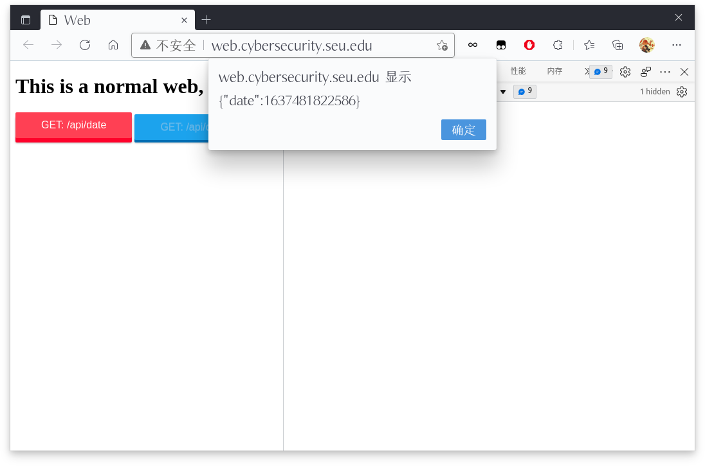

# WEB安全大作业 #01

57118321 马天行

## 作业要求

### 00 提交方式

* 在github创建repo: websec_assignment1
* repo中需要包含docker-compose.yml和host下的程序
* 截止时间为2021.11.23 11:00

### 01 用Docker配置三台主机

| Host Name | IP Address | Domain Name                        |
| --------- | ---------- | ---------------------------------- |
| host1     | 10.0.0.2   | http://web.cybersecurity.seu.edu   |
| host2     | 10.0.0.3   | http://time.cybersecurity.seu.edu  |
| host3     | 10.0.0.4   | http://jsonp.cybersecurity.seu.edu |

### 02 在http://time.cybersecurity.seu.edu上实现三个接口

| Path           | Utility                                                  |
| -------------- | -------------------------------------------------------- |
| /api/date      | 返回形式{date: Date.now()}的JSON数据                     |
| /api/datecors  | 返回形式{date: Date.now()}的JSON数据，并设置CORS头部字段 |
| /api/jsonpdate | 返回形式JSONP数据                                        |

### 03 在http://web.cybersecurity.seu.edu上实现一个页面

读取http://time.cybersecurity.seu.edu中的数据，分别测试：

* 在http://time.cybersecurity.seu.edu未设置CORS头时
* 在http://time.cybersecurity.seu.edu已设置CORS头时

提供读取数据成功/失败的截图。

### 04 在http://jsonp.cybersecurity.seu.edu上实现一个页面

测试在http://time.cybersecurity.seu.edu未设置CORS头时，通过JS回调读取/api/jsonpdate数据，提供读取数据成功的截图。

## 基础知识：JSONP

JSONP(JSON with Padding)是JSON的一种使用模式，可以用于跨域读取数据。大致来说，他利用了\<script\>标签没有跨域限制这个机制来达到与第三方通讯的目的。

例如下面这个页面: 

```html
<!--Host3前端-->
<!DOCTYPE html>
<html lang="en">

<head>
  <meta charset="UTF-8" />
  <title>Hello</title>
</head>

<body>
  <srcipt>
    function logInfo(data) {
      console.log(data)
    }
  </srcipt>
  <srcipt src="https://www.another.com/api/jsonp?callback=logInfo"> </srcipt>
</body>

</html>
```

```javascript
// Host2后端
const http = require("http")
const url_module = require("url")

const server = http.createServer()

server.on("request", (req, res) => {
  const { pathname: url, query } = url_module.parse(req.url, true)
  let data = "Hello!"
  if (url === "/api/jsonp") {
    let message = `${query.callback}(${JSON.stringify(data)})`
    res.send(message)
  } else {
    res.send("404 Not Found.")
  }
})

server.listen(80, () => {
  console.log("server running at http://localhost")
})
```

Host3的前端网页中通过src属性的方式指定了Host3后端接口，以及约定好的回调函数的名字作为参数。Host3后端收到对应的query之后，组织一条message，其中query.callback就是约定的回调函数的名字，这个例子里面就是logInfo，后面再加上($(JSON.stringify(data)))，连在一起就相当于调用了logInfo("Hello")，Host3后端再将这个合法的JS语句返回给Host2前端网页上执行。总之是一种邪道方法，就TM离谱。

## Host1: web

### 网页代码

```html
<!DOCTYPE html>
<html lang="en">

<head>
  <meta charset="UTF-8" />
  <title>Web</title>
  <link rel="stylesheet" href="buttons.css" type="text/css" />
</head>

<body>
  <script>
    function onClickBtn(url) {
      let req = new XMLHttpRequest()
      req.open("GET", url, true)
      req.onreadystatechange = () => {
        if (req.readyState === 4 && req.status === 200) {
          let data = req.responseText
          alert(data)
        }
      }
      req.send()
    }
  </script>
  <h1>This is a normal web, really.</h1>
  <button class="button button-3d button-caution"
    onclick="onClickBtn('http://time.cybersecurity.seu.edu/api/date')">GET: /api/date</button>
  <button class="button button-3d button-primary"
    onclick="onClickBtn('http://time.cybersecurity.seu.edu/api/datecors')">GET: /api/datecors</button>
</body>

</html>
```

### 网页样式


### 服务器代码

```javascript
const express = require("express")
const fs = require("fs")

const app = express()

app.get("/", (req, res) => {
  fs.createReadStream("index.html").pipe(res)
})

app.get("/buttons.css", (req, res) => {
  fs.createReadStream("buttons.css").pipe(res)
})

app.listen(80)
console.log("express app running at http://10.0.0.2 ~ http://web.cybersecurity.seu.edu")
```

## Host2: time

### 服务器代码

```javascript
const express = require("express")
const fs = require("fs")

const app = express()

app.get("/", (req, res) => {
  fs.createReadStream("./index.html").pipe(res)
})

app.get("/api/date", (req, res) => {
  res.send({ date: Date.now() })
})

app.all("/api/datecors", (req, res) => {
  res.header("Access-Control-Allow-Origin", "http://web.cybersecurity.seu.edu")
  res.header("Access-Control-Allow-Methods", "GET")
  res.send({ date: Date.now() })
})

app.get("/api/jsonpdate", (req, res) => {
  let jsonp_command = `${req.query.callback}(${JSON.stringify(Date.now())})`
  res.send(jsonp_command)
})

app.listen(80)
console.log(
  "express app running at http://10.0.0.3 ~ http://time.cybersecurity.seu.edu"
)
```

## Host3: jsonp

### 网页代码

```html
<!DOCTYPE html>
<html lang="en">

<head>
  <meta charset="UTF-8" />
  <title>JsonP</title>
</head>

<body>
  <h1>This page use a JsonP trick.</h1>
  <script>
    function getDate(data) {
      alert(`{\"date\":${data}}`)
    }
  </script>
  <script src="http://time.cybersecurity.seu.edu/api/jsonpdate?callback=getDate"></script>
</body>

</html>
```

### 网页样式


### 服务器代码

```javascript
const express = require("express")
const fs = require("fs")

const app = express()

app.get("/", (req, res) => {
  fs.createReadStream("./index.html").pipe(res)
})

app.listen(80)
console.log("express app running at http://10.0.0.4 ~ http://jsonp.cybersecurity.seu.edu")
```

## 实验结果

### http://web.cybersecurity.seu.edu调用/api/date的结果


### http://web.cybersecurity.seu.edu调用/api/datecors的结果



### http://jsonp.cybersecurity.seu.edu调用/api/jsonpdate的结果


